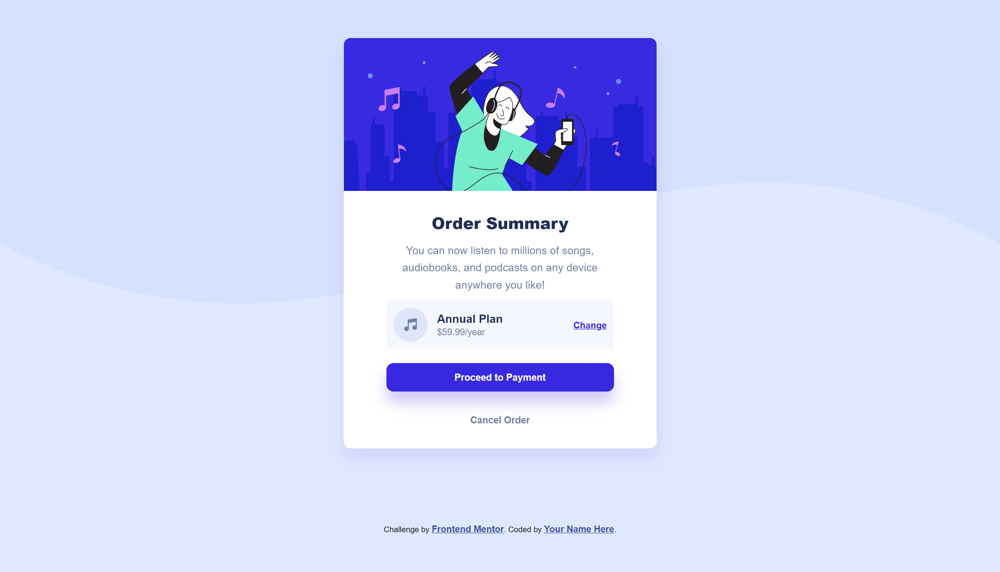

# Frontend Mentor - Order summary card solution

This is a solution to the [Order summary card challenge on Frontend Mentor](https://www.frontendmentor.io/challenges/order-summary-component-QlPmajDUj). Frontend Mentor challenges help you improve your coding skills by building realistic projects. 

As most of my work, this solution is being constantly updated as I learn new things and find better solutions for my problems, so please, take this into consideration. :)

## Table of contents

- [Overview](#overview)
  - [The challenge](#the-challenge)
  - [Screenshot](#screenshot)
  - [Links](#links)
- [My process](#my-process)
  - [Built with](#built-with)
  - [What I learned](#what-i-learned)
- [Author](#author)

## Overview

### The challenge

Users should be able to:

- See hover states for interactive elements

### Screenshot

.png)

### Links

[Demo](https://fluffykas.github.io/order-summary-component/)

## My process

### Built with

- Semantic HTML5 markup
- CSS custom properties
- Flexbox
- Grid layout

## Author

- Frontend Mentor - [@Phoenix243](https://www.frontendmentor.io/profile/PhoenixMputu)
- Facebook [Victori deo Tshimbadi](https://web.facebook.com/profile.php?id=100009472016818)
- Stack Overflow [@Phoenix23](https://stackoverflow.com/users/15827134/phoenix23)
- LinkedIn [Victory Deo](https://www.linkedin.com/in/victory-deo-tshimbadi-a8a8b920a/)
- Instagram [Victory Deo Tshimbadi](https://www.instagram.com/victory_deo_phoenix/)
